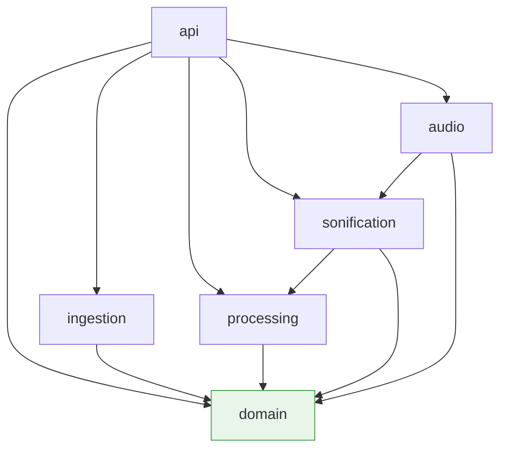
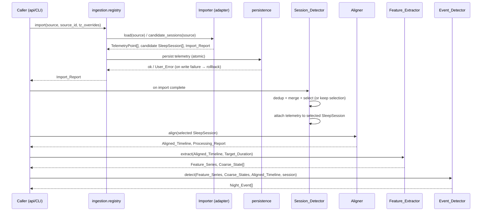

# Design Document

## Overview

The sleep-replay-data-pipeline is the first of three specs that make up the Sleep Replay MVP. It turns raw device exports (a Fitbit_Export and a SensorPush_CSV) into normalized, aligned, feature-extracted data plus detected Night_Events. It stops short of any sonification, audio rendering, or UI. Its outputs — persisted TelemetryPoints, candidate and selected SleepSessions, an Aligned_Timeline, Feature_Series, Coarse_States, and Night_Events — are the inputs the sleep-replay-sonification and sleep-replay-app specs build on.

The design centers on a strict, one-directional data flow:

```
files/zip ──▶ Importer (Data_Source_Adapter) ──▶ TelemetryPoint[] + candidate SleepSession[]
                                                        │
                                                        ▼
                            persistence (Data_Directory + Metadata_Store)
                                                        │
                                                        ▼
       Session_Detector ──▶ selected SleepSession (with attached telemetry + stages)
                                                        │
                                                        ▼
                    Aligner ──▶ Aligned_Timeline (per-metric values, Missing_Data_Mask, Sleep_Stage)
                                                        │
                                                        ▼
                    Feature_Extractor ──▶ Feature_Series + Movement_Intensity + Coarse_State[]
                                                        │
                                                        ▼
                    Event_Detector ──▶ Night_Event[]
```

Everything downstream of the Importers speaks only the domain vocabulary (TelemetryPoint, Stage_Segment, SleepSession, Aligned_Timeline, Feature_Series, Coarse_State, Night_Event, Target_Duration, Random_Seed). No processing component ever sees a file path, raw bytes, or a Fitbit/SensorPush-specific record (Requirement 1.6, 17.2). This is what keeps new data sources to an adapter change alone.

The pipeline is local-first and deterministic. All timestamps are converted to UTC before alignment, so re-aligning under a different Display_Timezone yields an identical Aligned_Timeline and Input_Fingerprint (Requirement 9.5). Alignment, feature extraction, and event detection are pure functions of their domain inputs, which is what makes the large body of invariants and round-trip/monotonicity/order-preservation/confluence properties in the requirements testable.

### Design goals and key decisions

| Decision | Rationale |
|---|---|
| Domain package holds all shared types and the adapter interface, and imports nothing else in the Backend | Enforces Dependency_Rules (17.2a, 17.4); lets ingestion and processing depend on domain without depending on each other |
| Importers return domain objects, never raw records | Requirement 1.6/7.1; keeps processing source-agnostic |
| A single normalization boundary: values are stored in source units by Importers, converted to Canonical_Unit only by the Aligner | Requirement 1.4 (record source unit), 10.3 (convert to canonical before dedup/resample); keeps the Import_Report round-trippable in source units |
| All processing keyed on UTC instants | Requirement 9.5, 9.8; determinism across Display_Timezone changes |
| Persistence writes telemetry atomically (temp file + rename) | Requirement 1.9, 16.5 — a failed import leaves earlier imports untouched |
| SQLite Metadata_Store holds records/metadata only; telemetry values live in per-import files under the Data_Directory | Requirement 15.1/15.3; keeps the DB small and log content restrictions enforceable |
| Pure, deterministic core functions with side effects pushed to the edges (I/O in ingestion + persistence) | Makes the invariants and confluence/determinism properties directly testable with property-based tests |

### Confirmation of Input Format Assumptions

The design confirms the Input Format Assumptions in the requirements as the formats the MVP supports, with the following implementation notes (no substantive change to the assumptions):

- **Fitbit files are matched by the final path component, case-insensitively**, treating `YYYY`, `MM`, `DD` as 4/2/2-digit numbers, at any archive depth (Requirement 5.2). The five patterns are: `sleep-YYYY-MM-DD.json`, `heart_rate-YYYY-MM-DD.json`, `steps-YYYY-MM-DD.json`, `Heart Rate Variability Details - YYYY-MM-DD.csv`, and `Daily Heart Rate Variability Summary - YYYY-MM(-DD).csv` (the daily summary optionally omits the day).
- **Fitbit intraday heart rate and steps default to UTC**; sleep, HRV details, and daily HRV summary default to Display_Timezone. Every default is user-overridable per file type at import (Requirement 9.2), and the Aligner emits a likely-mismatch warning when heart_rate coverage is poor but nearby heart_rate data exists (Requirement 9.9).
- **`levels.shortData` entries are Brief_Awakenings** that override the underlying `levels.data` level for their span (Requirement 3.3/3.4).
- **SensorPush columns are identified by case-insensitive header keywords** with the stated exclusions (`dew` excluded from temperature; `absolute` excluded from humidity). Single-letter `F`/`C` are recognized only as standalone tokens (Requirement 6.3). Unit inference from column medians applies only when the header states no unit (Requirement 6.4, 6.14).
- **Day-first dates are unsupported**; slash-separated dates are month/day/year (Requirement 6.6). Explicit offsets always win over the Source_Timezone.
- **Canonical_Units**: heart_rate bpm, hrv_rmssd ms, steps steps/min, temperature °C, humidity %, pressure hPa.

`docs/data-formats.md` will document these assumptions for users (Requirement referenced by the Input Format Assumptions section; the doc deliverable itself is tracked in sleep-replay-app).

## Architecture

### Backend package structure

The Backend is organized into six Python packages plus the ingestion sub-packages, satisfying Requirement 17.1. The Frontend lives outside all Backend packages (built in sleep-replay-app). This spec implements ingestion, domain, processing, and the persistence/error foundation; the sonification, audio, and api packages are created as thin placeholders here and filled in by later specs.

```
backend/
  domain/                     # shared types + adapter interface; imports NO other backend package
    __init__.py
    telemetry.py              # TelemetryPoint, Metric, Canonical_Unit, unit conversion tables
    stages.py                 # Sleep_Stage, Stage_Name_Mapping, Stage_Segment, Brief_Awakening flag
    session.py                # SleepSession, Session_HRV
    timeline.py               # Aligned_Timeline, Missing_Data_Mask, Sample_Interval helpers
    features.py               # Feature_Window, Feature_Series, Movement_Intensity, Coarse_State
    events.py                 # Night_Event, Event_Vocabulary, event types
    adapter.py                # Data_Source_Adapter Protocol (load + optional candidate sessions)
    errors.py                 # User_Error, error codes, Import_Report, Processing_Report, Warning
    units.py                  # canonical-unit conversion + unit parsing helpers
  ingestion/                  # imports NO processing/sonification/audio/api package
    __init__.py
    registry.py               # adapter registration by Source_Identifier
    fitbit/                   # Fitbit_Importer sub-package
      __init__.py
      importer.py             # implements Data_Source_Adapter (load + candidate sessions)
      packaging.py            # zip/individual-file handling, member matching, size limits
      sleep.py                # sleep-log parsing → candidate SleepSessions + Stage_Segments
      intraday.py             # heart rate / steps parsing → TelemetryPoints
      hrv.py                  # HRV details + daily HRV summary parsing
      timestamps.py           # Fitbit timestamp formats (MM/DD/YY HH:MM:SS, ISO)
    sensorpush/               # SensorPush_Importer sub-package
      __init__.py
      importer.py             # implements Data_Source_Adapter (load only)
      csv_reader.py           # delimiter/BOM detection, header keyword matching
      units.py                # unit-token recognition + median-based inference
      timestamps.py           # SensorPush timestamp formats
  processing/                 # imports NO ingestion/api package
    __init__.py
    session_detector.py       # discovery, dedup, merge, selection, manual ranges, telemetry attach
    timezones.py              # IANA resolution, DST ambiguity/gap handling, UTC conversion
    aligner.py                # sort/dedup/convert/select-sensor/resample → Aligned_Timeline
    resample.py               # interpolation, Max_Interpolation_Gap, steps hold, stage assignment
    features.py               # Feature_Extractor: windows, series, movement, coarse states
    events.py                 # Event_Detector: detection, merge window, cap, ordering, magnitude
    compression.py            # Compression_Ratio, Night_Time↔Replay_Time mapping, Target_Duration
  persistence/                # storage foundation (part of the "domain/foundation" concern)
    __init__.py
    data_directory.py         # Data_Directory resolution + startup checks
    telemetry_store.py        # atomic write/read of normalized telemetry per import
    metadata_store.py         # SQLite: imports, sessions, settings, replay records
  sonification/               # placeholder (built in sleep-replay-sonification)
  audio/                      # placeholder (built in sleep-replay-sonification)
  api/                        # placeholder (built in sleep-replay-app)
sample_data/                  # committed Sample_Dataset (Fitbit files + SensorPush CSV)
tools/
  sample_data_generator.py    # Sample_Data_Generator (deterministic)
tests/
docs/
```

Note on `persistence`: Requirement 17.1 names six Backend packages (ingestion, domain, processing, sonification, audio, api). Persistence is a foundation concern used by ingestion and processing and invoked by the api layer. To avoid a new top-level Backend package that the Dependency_Rules do not mention, the persistence helpers live in the `domain` package's foundation area (`domain/persistence` conceptually) OR as a `processing`-adjacent module — the design places them in a `persistence` module set that `domain` exposes, so `domain` still imports no other Backend package and ingestion/processing may use it. The Documentation names which package implements each concern (Requirement 17.1). The dependency test (17.3) enforces the rules regardless of the physical folder.

### Dependency_Rules

The rules from Requirement 17.2, expressed as a directed allow-list. A package "depends on" another if any source file imports it (absolute or relative, module-level or in-function; stdlib/third-party unrestricted).



Rules enforced (17.2):
- (a) `domain` imports no other Backend package.
- (b) `ingestion` imports no `processing`, `sonification`, `audio`, or `api` package.
- (c) no Importer sub-package imports another Importer sub-package (`fitbit` ⁄↔ `sensorpush`).
- (d) `processing`, `sonification`, `audio` import no `ingestion` package.
- (e) `ingestion`, `domain`, `processing`, `sonification`, `audio` import no `api` package.

A dependency test (Requirement 17.3) walks every Backend source file, parses its import statements with the `ast` module, resolves each import to a Backend package, and asserts none violates (a)–(e). On violation it fails and prints the violating source file and the imported package.

### High-level import + processing sequence



## Components and Interfaces

### Data_Source_Adapter interface (domain/adapter.py)

The adapter is the single seam between raw sources and the pipeline (Requirement 7). Defined as a `typing.Protocol` so importers implement it structurally.

```python
class Data_Source_Adapter(Protocol):
    source_identifier: str  # stable, unique, e.g. "fitbit" or "sensorpush" (Requirement 7.1)

    def load(self, source: Source) -> LoadResult:
        """Read a source (local file paths or one zip archive for MVP importers)
        and return normalized TelemetryPoints plus an Import_Report.
        Each TelemetryPoint has: timezone-aware timestamp; source == source_identifier
        (optionally with sensor id); a Metric; a finite value; a unit convertible to the
        metric's Canonical_Unit. (Requirement 7.1)"""

    # Optional. Session_Detector treats a missing implementation as zero candidates. (7.2)
    def candidate_sessions(self, source: Source) -> list[SleepSession]:
        """Return candidate SleepSessions, each with start_time < end_time and
        Stage_Segments whose stages are Sleep_Stage values. (Requirement 7.2)"""
```

- `Source` = a list of local file paths, or exactly one `.zip` path (MVP). The type is deliberately opaque to the pipeline.
- `LoadResult` bundles `telemetry: list[TelemetryPoint]`, `sessions: list[SleepSession]` (empty for adapters without stage data), `session_hrv: dict[...]` for daily summaries, and the `Import_Report`.
- The registry (`ingestion/registry.py`) maps `source_identifier → adapter`. Registering a new adapter is the only code needed to support a new source (Requirement 7.4); the Aligner, Session_Detector, Feature_Extractor, and Event_Detector need no change.
- Validation gate: after `load`, the Backend drops any TelemetryPoint with a naive timestamp, a metric outside the MVP Metrics, a non-finite value, or an inconvertible unit, retains the rest, and reports the excluded count per reason in the Import_Report (Requirement 7.7). A whole-source failure returns a User_Error and stores nothing (Requirement 7.6).
- The Documentation describes both operations, the TelemetryPoint fields, the MVP Metric names and Canonical_Units, adapter registration steps, and the SensorPush cloud API adapter as an unimplemented extension point (Requirement 7.8).

### Fitbit_Importer (ingestion/fitbit)

Implements `load` and `candidate_sessions`.

- **packaging.py** — Accepts individual files or exactly one `.zip` (Requirement 5.1). Rejects a mix of a zip with individual files, or more than one zip (5.9), with a User_Error. Matches members by the five file-name patterns on the final path component, case-insensitively, at any depth (5.2). Reads zip members directly from the archive without ever writing a path derived from a member name — guards against absolute paths and `..` traversal (5.3). Enforces Max_Archive_Member_Size both on the declared uncompressed size and on the actual decompressed byte stream, stopping and recording the member on overflow (5.4). Skips unmatched members into an unsupported-files list with a total count (5.5). Returns a User_Error listing every supported pattern and Takeout steps when nothing matches (5.6), when the archive can't be opened (5.10). Records per-file skip reasons for password-protected/undecompressable/unparseable/non-array-JSON/missing-column files (5.7).
- **sleep.py** — One candidate SleepSession per sleep-log entry (Requirement 3.1). Builds Stage_Segments from `levels.data` (3.2), inserts `levels.shortData` as Brief_Awakening awake segments, splitting overlapped segments so the before/after portions keep their original stage (3.3, 3.4, plus Stage_Segment overlap rule 2.8). Maps stage/classic level names via Stage_Name_Mapping (3.5); unknown level names become `unknown` with a per-distinct-name-per-file warning (3.7). Empty/absent levels → single `unknown` segment spanning the session with a warning (3.6). Clips segments to session bounds and discards zero-length results (2.9, 3.2). Skips entries missing/invalid startTime/endTime (3.9) or with end ≤ start (2.7). Attaches logId and isMainSleep for the Session_Detector; missing/non-boolean isMainSleep → false (3.8, 3.11). Skips invalid levels entries (bad dateTime/seconds ≤ 0) incrementing skipped-value count (3.10).
- **intraday.py** — heart_rate TelemetryPoints in bpm from `MM/DD/YY HH:MM:SS` + `value.bpm` (4.1); steps in steps/min from `value` whether string or number (4.4). Range gates: heart_rate 20–250, steps 0–300 → excluded values counted (4.8). Unparseable dateTime rows skipped and counted (4.7). On selection, only loads intraday/HRV files whose file-name date is within [start−1 day, end+1 day] in Display_Timezone (4.5).
- **hrv.py** — hrv_rmssd from HRV Details `timestamp` (ISO 8601) + `rmssd` (4.2), other columns ignored. Daily HRV summary supplies Session_HRV when no in-session hrv_rmssd exists and a summary row is dated on the session end_time's calendar date in Display_Timezone (mean when several match) (4.3). rmssd range gate 0 < rmssd ≤ 500 (4.8).
- Missing whole metrics add a warning per metric, not a User_Error (4.6).

### SensorPush_Importer (ingestion/sensorpush)

Implements `load` only (no stage data → contributes zero candidate sessions, 7.2).

- **csv_reader.py** — Detects comma/semicolon delimiter and optional UTF-8 BOM (stripped from the first header, 6.5); ignores blank lines without counting them (6.5). Identifies timestamp/temperature/humidity/pressure/sensor-id columns by case-insensitive keyword with exclusions (6.2). Leftmost column wins on duplicate type matches, others ignored with a warning (6.12). Errors: no timestamp column, or none of temp/humidity/pressure → User_Error listing detected headers and expected keywords, no points created (6.7); no data rows or no row yields a point → User_Error listing supported timestamp formats (6.9).
- **units.py** — Unit tokens per column with standalone-`F`/`C` recognition (6.3). Header without unit → infer from column median (temp >45 → °F else °C; pressure 25–32 inHg, 90–110 kPa, 900–1100 hPa; humidity always %), warn (6.4). Pressure median outside all ranges → no pressure points, keep others, warn (6.14).
- **timestamps.py** — ISO 8601 (±offset/Z) and US `M/D/YYYY` 12h/24h; slash dates are M/D/Y; explicit offset wins, else Source_Timezone (Display_Timezone default) (6.6). Empty/unparseable timestamp on a non-blank row → skip row, count it (6.8).
- **importer.py** — One TelemetryPoint per parseable measurement cell per row (6.1). Row's sensor id folded into `source`; empty sensor id → SensorPush source without id (6.11). Empty/non-numeric measurement cell skipped per-value, row's other values kept, skipped-value count incremented (6.13). Missing one or two of temp/humidity/pressure (timestamp present) → import available, warn per missing metric (6.10).

### Session_Detector (processing/session_detector.py)

Pure functions over candidate SleepSessions plus the full TelemetryPoint set.

- **List** all remaining candidates after dedup + merge, each with start/end in Display_Timezone, duration h:m, and stage-data availability (`stages`/`classic`/`none`), ordered latest→earliest start (Requirement 8.1).
- **Dedup** candidates sharing a logId or identical start/end: keep one, preferring main-sleep, then `stages`, then first-sorting file name; count discarded (8.5).
- **Merge** overlapping candidates (strict overlap; touching does not count) into the union interval, using the main-sleep candidate's Stage_Segments in the overlap (longer, then earlier, as tiebreak), keeping non-overlapping segments, OR-ing the main-sleep flag, repeating to fixpoint, warning with merged bounds (8.6).
- **Automatic selection** while nothing user-chosen/manual is selected: latest-start among main-sleep candidates (8.2); else the longest candidate whose end falls on the latest end-date in Display_Timezone, later start breaks ties (8.3).
- **User choice / manual range** replace the selection (8.4, 8.8). Manual range: both times in Display_Timezone, one `unknown` segment covering the range, no main-sleep flag; validation rejects missing/unparseable/end≤start/>24h with a User_Error and keeps the current selection (8.8, 8.9).
- **Empty**: import complete, no candidates anywhere, no manual selection → User_Error offering manual definition, telemetry kept (8.7).
- **Telemetry attach**: when a session becomes selected, or an import completes while one is selected, attach every TelemetryPoint from all imports with start_time ≤ instant ≤ end_time and no others (8.10). A selected user/manual session stays selected across imports; if merged with a new candidate, the containing merged session stays selected (8.11).

### timezones.py (processing)

- Resolves the Source_Timezone per file type: user override → default from Input Format Assumptions (a `Display_Timezone` default means the Display_Timezone at import start) (Requirement 9.1, 9.2). Explicit offsets in a timestamp always win (9.3).
- DST handling for offset-free times: ambiguous (repeated hour) → earlier UTC instant; nonexistent (skipped hour) → shift forward by the gap length; one warning per affected file naming the count of adjusted timestamps (9.4).
- Invalid IANA override → reject import with a User_Error naming the value and file type; nothing imported, earlier data unchanged (9.10).
- Display_Timezone resolution: config setting at startup → host timezone; invalid or undeterminable → UTC with a Frontend warning (Frontend part in sleep-replay-app) (9.6, 9.11).
- All conversion to UTC happens here before alignment (9.5); elapsed time is UTC elapsed, so a 22:00→06:00 local session is 9h across fall-back and 7h across spring-forward (9.8).

### Aligner (processing/aligner.py, processing/resample.py)

Pure function: `(SleepSession) -> (Aligned_Timeline, Processing_Report)`.

1. Convert every value to its metric's Canonical_Unit; exclude inconvertible points with a warning (10.3, 10.16). Convert timestamps to UTC (9.5).
2. Sort each (source, metric) by timestamp (10.1); collapse same-(source, metric, timestamp) duplicates to their arithmetic mean, counting removed duplicates per source/metric (10.2).
3. Sensor selection for temperature/humidity/pressure when multiple sources exist: keep the source with the most points for that metric (lexicographically-first source id on ties), warn naming metric/selected/ignored (10.13).
4. Choose Timeline_Resolution: smallest candidate ≥ the shortest median inter-sample interval among Continuous_Metrics with ≥2 points; else 60 s; also 60 s when the shortest median > 60 s (10.4, 10.5).
5. Build samples at start + k·resolution (elapsed, UTC) strictly before end_time (10.6). Sample count = ceil(duration_seconds / resolution_seconds) (10.15).
6. Per Continuous_Metric per Sample_Interval [t_i, t_{i+1}): mean of measured values inside the interval (10.7); else linear interpolation at the sample timestamp when the bracketing measured values are ≤ Max_Interpolation_Gap apart (10.8); else mark missing and record a gap entry (metric, last-value timestamp, elapsed gap) (10.9). No extrapolation before first / after last value → missing; a metric with no in-session value → all missing + "unavailable" (10.10).
7. Steps: assign each steps value unchanged to samples whose timestamp is within [steps_ts, steps_ts+60s); samples in no steps minute → missing for steps (10.12, 10.17). No interpolation for steps.
8. Sleep_Stage per sample from the Stage_Segment whose half-open [start,end) contains the sample timestamp, else `unknown`, no stage interpolation (10.11).

Invariants guaranteed by construction: every non-missing sample value lies within [min, max] of the deduplicated canonical measured values used (10.14); sample count = ceil(duration/resolution) (10.15); identical result for any input ordering (10.18).

### compression.py (processing) — Night compression time mapping

- Five Target_Durations only: 30, 120, 180, 300, 600 s (Requirement 11.1). Selection precedence: request → Mapping_Config.target_duration → 180 s (11.2). A value outside the five → User_Error listing the accepted values, no Replay, previous target kept (11.7).
- Compression_Ratio = session_duration_seconds / target_seconds, recorded with ≥3 decimals; Target_Duration in seconds recorded in the Replay_Manifest (11.3). (Manifest itself is written in sleep-replay-sonification; this spec computes and exposes the values.)
- Mapping: Replay_Time(t) = (t − start_time) / Compression_Ratio; start→0, end→Target_Duration, within 1 ms (11.4). Strictly order-preserving for t1 < t2 (11.5).
- session_duration ≤ target → User_Error listing offered durations shorter than the session (or "too short" when none), no WAV, records unchanged (11.6).

### Feature_Extractor (processing/features.py)

Pure function: `(Aligned_Timeline, Target_Duration) -> (Feature_Series, Coarse_State[])`.

- Windows: consecutive non-overlapping Feature_Windows, each (except the last) spanning Compression_Ratio × Feature_Window_Span (0.5 s Replay_Time) of Night_Time; last ends at session end_time; a window holds samples with timestamp in [win_start, win_end), the last also the end_time sample (12.1). Window count = ceil(Target_Duration / Feature_Window_Span) (12.10).
- Per Continuous_Metric per window: mean/min/max/slope (least-squares vs Night_Time, canonical unit per hour) over non-missing samples; missing-sample fraction = missing count / window sample count (12.2). No non-missing sample → mean/min/max/slope missing, fraction 1.0 (12.3).
- Smoothed value: mean of non-missing samples within the metric's smoothing window (heart_rate 5 min; others 15 min) centered on the window midpoint, truncated to session bounds; none in interval → missing (12.4, 12.5).
- Stage fractions per window: fraction of window Night_Time by Sleep_Stage, Brief_Awakenings taking precedence over overlaps, uncovered → unknown; dominant stage = largest fraction, ties in fixed order awake, rem, light, deep, asleep, restless, unknown (12.6). Fractions sum to 1.0 ± 1e-6 (12.11).
- Movement_Intensity: from mean steps/min of non-missing steps samples — monotone non-decreasing in mean, 0 steps → 0.0, all in [0,1], no non-missing steps sample in a window → 0.0 (12.7). When the session has no non-missing steps sample at all, fall back to the fraction of window Night_Time covered by restless segments or Brief_Awakenings, with a Processing_Report warning (12.8).
- Coarse_State: group consecutive equal-dominant-stage windows into runs; in chronological order, merge any run shorter than Minimum_State_Duration (1.0 s Replay_Time) into the preceding run (or following, if it is the first), combine adjacent runs that then match, repeat to fixpoint (12.9). Result length = window count; every equal-Coarse_State run ≥ Minimum_State_Duration (12.12).

### Event_Detector (processing/events.py)

Pure function over the session, Aligned_Timeline, Feature_Series, and Coarse_States.

- sleep onset (magnitude 1.0) at sleep onset time when defined (13.1, 13.14).
- awakening (1.0) at final wake time when defined (13.3, 13.14).
- wake ("awake") at the start of an awake Stage_Run after onset, ending ≤ final wake, lasting ≥ Wake_Event_Min_Duration (5 min); magnitude min(1, dur/(2·5min)) (13.2, 13.14).
- stage transition ("light sleep"/"deep sleep"/"REM") at the start of a light/deep/rem Stage_Run after onset lasting ≥ Major_Transition_Min_Duration (10 min); magnitude min(1, dur/(2·10min)) (13.4, 13.14).
- movement at the start of a Movement_Run reaching Movement_Burst_Threshold (0.6); magnitude = max Movement_Intensity of the run (13.5, 13.14).
- restless period at the start of a Movement_Run at/above Restless_Threshold (0.3) lasting ≥ Restless_Min_Duration (10 min); magnitude = mean Movement_Intensity of the run (13.6, 13.14).
- environmental rising/falling: compare smoothed temp/humidity/pressure at a sample to earlier non-missing samples within the metric's change span (temp/humidity 30 min, pressure 3 h); if the greatest-absolute difference ≥ threshold (temp 1.0 °C, humidity 5 pp, pressure 1.0 hPa), emit rising (positive) or falling (negative); magnitude min(1, |Δ|/(2·threshold)) (13.7, 13.14). Only compare non-missing pairs both at/after the last emitted env event of that metric for that metric; <2 non-missing → none (13.8).
- Merge: an event within the same-type merge window (15 min) after a retained same-type event is discarded, retained event's magnitude = max of the two; processed ascending Night_Time (13.9).
- Cap at Max_Event_Count (12): keep sleep onset + awakening when present, fill remaining slots by descending magnitude (earlier Night_Time breaks ties), discard the rest (13.10).
- If the session has no non-(awake/unknown) stage: no onset/wake/awakening/stage-transition events, but still emit movement/restless/environmental (13.15). No conditions met → empty list, no User_Error (13.16).
- Every event: a type mapping to exactly one Event_Vocabulary description; Night_Time within the session; Replay_Time via the Requirement 11 mapping; magnitude in [0,1]; label = `HH:MM` (24h, Display_Timezone, minute-truncated) + space + description (13.11). Ordered ascending Night_Time, ties by Event_Vocabulary order (13.12). Replay_Time in [0, Target_Duration] (13.13).

### Sample_Data_Generator (tools/sample_data_generator.py)

Deterministic generator seeded by a documented Random_Seed, producing byte-identical files on Windows/Linux (Requirement 14.8). Uses a fixed PRNG (`random.Random(seed)` with explicit rounding and fixed field formatting; no reliance on dict ordering or float repr differences) and writes files with `\n` newlines and fixed decimal precision.

- Emits Fitbit sleep (one `stages` entry, isMainSleep true, exactly 8h apart in Sample_Timezone on a non-DST night, 14.2), heart_rate, HRV details, steps files, and one SensorPush CSV with unit-bearing headers (14.1).
- Structural targets: 4–6 sleep cycles (rem runs ≥5 min, ≥60 min apart), more deep in first 4h, more rem in last 4h (14.3); heart rate 5 s cadence, 45–80 bpm, deep-mean ≥5 bpm below awake-mean, one 10–30 min gap, ≥90% coverage (14.4); rmssd 5-min cadence 20–90 ms (14.5); per-minute steps with ≥3 bursts (>15 min apart) reaching Movement_Burst_Threshold and ≥1 restless period at 3-min Target_Duration (14.6); SensorPush 1-min cadence, humidity 35–60%, a ≤30 min ≥1.0 °C smoothed-temp span, a ≤3 h ≥1.0 hPa smoothed-pressure span, and a 20–60 min gap overlapping neither span (14.7); ≥2 awake runs (5–20 min, >15 min apart) after onset before final wake, and ≥3 Brief_Awakenings (30–90 s) (14.13).
- Round-trip: generating → writing files → importing with Sample_Timezone reproduces TelemetryPoints (timestamps to the second, values within half a unit of the last written decimal) and Stage_Segments exactly (14.9).
- "Use sample data" imports with Sample_Timezone as the Source_Timezone for every file whose default is Display_Timezone, regardless of host timezone (14.11), yielding exactly one 8h candidate session and a clean Import_Report (14.12). Documentation states the dataset is synthetic and names the Sample_Timezone (14.10).

### Persistence (persistence/*)

- **data_directory.py** — Resolves Data_Directory from `SLEEP_REPLAY_DATA_DIR` (non-empty) else the documented default; creates it at startup; on non-creatable/non-writable, exits non-zero before accepting requests with a User_Error naming the path and the env override (Requirement 15.2, 15.4).
- **telemetry_store.py** — Persists an import's normalized TelemetryPoints atomically (write temp file in the Data_Directory, fsync, rename) before the Import_Report returns (1.7). Write failure → User_Error, no points of the failed import retained, earlier imports unchanged (1.9). Round-trip: persist then load returns the same-length, same-order list with identical instant/offset/source/metric/unit and exactly equal value (1.8). Unreadable or invalid persisted points → User_Error naming the affected import's source files and instructing re-import; none passed to the Aligner (1.10).
- **metadata_store.py** — SQLite holding import records, session records, settings, and Replay records (Metadata_Store). Everything else (values) lives in Data_Directory files. All writes stay inside the Data_Directory (15.1). Logging excludes telemetry values, Stage_Segments, per-sample timestamps, and file contents at every level (15.3).

## Data Models

All models live in the `domain` package. They are immutable value objects (frozen dataclasses) where practical, which reinforces the pure-function processing and the confluence/determinism properties.

### Core enumerations

```python
class Metric(str, Enum):
    heart_rate = "heart_rate"
    hrv_rmssd  = "hrv_rmssd"
    steps      = "steps"
    temperature = "temperature"
    humidity   = "humidity"
    pressure   = "pressure"

CONTINUOUS_METRICS = {heart_rate, hrv_rmssd, temperature, humidity, pressure}  # steps excluded

CANONICAL_UNIT = {
    heart_rate: "bpm", hrv_rmssd: "ms", steps: "steps/min",
    temperature: "C", humidity: "percent", pressure: "hPa",
}

class Sleep_Stage(str, Enum):
    awake = "awake"; light = "light"; deep = "deep"; rem = "rem"
    asleep = "asleep"; restless = "restless"; unknown = "unknown"

STAGE_NAME_MAPPING = {  # matched case-insensitively after trim
    "wake": awake, "awake": awake, "light": light, "core": light,
    "deep": deep, "rem": rem, "asleep": asleep, "restless": restless,
    # any other name -> unknown
}

# Fixed tie-break order for dominant stage (Requirement 12.6)
DOMINANT_STAGE_ORDER = [awake, rem, light, deep, asleep, restless, unknown]
```

### TelemetryPoint (domain/telemetry.py)

```python
@dataclass(frozen=True)
class TelemetryPoint:
    timestamp: datetime   # timezone-aware, explicit whole-second UTC offset (Req 1.2)
    source: str           # Source_Identifier, optionally + sensor id (Req 1.1)
    metric: Metric        # exactly one MVP metric (Req 1.3)
    value: float          # source-unit value, finite (Req 1.4/1.5)
    unit: str             # source unit; convertible to Canonical_Unit
```

A TelemetryPoint is *valid* (Req 1.8) iff: timezone-aware timestamp whose UTC offset is a whole number of seconds, non-empty source, a Metric, a finite value, and a unit listed for its metric in Requirement 1.4. Only valid points are persisted and aligned.

### Stage_Segment (domain/stages.py)

```python
@dataclass(frozen=True)
class Stage_Segment:
    start_time: datetime      # tz-aware
    end_time: datetime        # tz-aware, > start_time (Req 2.2)
    stage: Sleep_Stage
    is_brief_awakening: bool = False   # Brief_Awakening flag (Req 3.4)
```

Ordering/containment invariants (Req 2.2): ordered by start_time; each starts ≥ previous end; within [session.start, session.end].

### SleepSession (domain/session.py)

```python
@dataclass(frozen=True)
class SleepSession:
    start_time: datetime          # tz-aware
    end_time: datetime            # tz-aware, > start_time (else excluded, Req 2.7)
    source: str                   # producing Importer
    stages: tuple[Stage_Segment, ...]   # ordered; possibly empty (Req 2.1/2.2)
    telemetry: tuple[TelemetryPoint, ...]  # points with start<=ts<=end (Req 2.1/8.10)
    # provenance for the Session_Detector:
    log_id: str | None = None     # Fitbit logId (Req 3.8)
    is_main_sleep: bool = False    # Req 3.8/3.11
    session_hrv: float | None = None  # Session_HRV in ms (Req 4.3)

    # Derived (Req 2.5/2.6/2.10): may be None when no non-(awake/unknown) segment exists
    @property
    def sleep_onset_time(self) -> datetime | None: ...
    @property
    def final_wake_time(self) -> datetime | None: ...
```

`has_stage_data` (Req: Stage_Data) is true iff any Stage_Segment has a stage other than `unknown`. Stage-data availability label for listing: `stages`, `classic`, or `none` (Req 8.1).

### Aligned_Timeline (domain/timeline.py)

```python
@dataclass(frozen=True)
class Aligned_Timeline:
    start_time: datetime           # session start (tz-aware / UTC internally)
    end_time: datetime
    resolution_s: int              # Timeline_Resolution, one of 1,5,10,15,30,60
    timestamps: tuple[datetime, ...]  # start + k*resolution < end (Req 10.6)
    values: dict[Metric, tuple[float | None, ...]]   # per-metric per-sample
    missing: dict[Metric, tuple[bool, ...]]          # Missing_Data_Mask (Req 10.9/10.10)
    stages: tuple[Sleep_Stage, ...]  # per-sample stage (Req 10.11)
```

- `len(timestamps) == ceil(duration_s / resolution_s)` (Req 10.15).
- Sample_Interval of sample i = [timestamps[i], timestamps[i+1]); the last ends at end_time.
- For any metric, `missing[m][i] is False` ⇒ `values[m][i]` lies within [min, max] of the deduplicated canonical measured values used for m (Req 10.14).

### Feature_Series, Feature_Window, Coarse_State (domain/features.py)

```python
@dataclass(frozen=True)
class Metric_Window_Features:
    mean: float | None; minimum: float | None; maximum: float | None
    slope: float | None            # canonical unit per hour vs Night_Time
    missing_fraction: float        # [0,1]
    smoothed: float | None

@dataclass(frozen=True)
class Feature_Window:
    start_time: datetime; end_time: datetime          # Night_Time bounds
    per_metric: dict[Metric, Metric_Window_Features]  # continuous metrics
    stage_fractions: dict[Sleep_Stage, float]          # sum == 1.0 ± 1e-6
    dominant_stage: Sleep_Stage
    movement_intensity: float                          # [0,1]

@dataclass(frozen=True)
class Feature_Series:
    windows: tuple[Feature_Window, ...]   # count == ceil(Target_Duration / Feature_Window_Span)
    compression_ratio: float

# Coarse_State is a Sleep_Stage per window; runs >= Minimum_State_Duration (Req 12.12)
Coarse_State = Sleep_Stage
```

### Night_Event (domain/events.py)

```python
class Event_Type(str, Enum):
    sleep_onset="sleep onset"; awake="awake"; awakening="awakening"
    light_sleep="light sleep"; deep_sleep="deep sleep"; rem="REM"
    movement="movement"; restless_period="restless period"
    temperature_rising="temperature rising"; temperature_falling="temperature falling"
    humidity_rising="humidity rising"; humidity_falling="humidity falling"
    pressure_rising="pressure rising"; pressure_falling="pressure falling"

EVENT_VOCABULARY_ORDER = [ ...as listed in the glossary, fixed order... ]  # tie-break (Req 13.12)

@dataclass(frozen=True)
class Night_Event:
    type: Event_Type
    night_time: datetime           # within the session (Req 13.11)
    replay_time_s: float           # via Req 11 mapping; in [0, Target_Duration] (Req 13.13)
    magnitude: float               # [0,1] (Req 13.14)
    label: str                     # "HH:MM <description>" in Display_Timezone (Req 13.11)
```

### Errors and reports (domain/errors.py)

```python
@dataclass(frozen=True)
class User_Error(Exception):
    code: str                 # stable per condition, listed in troubleshooting docs (Req 16.1)
    description: str          # plain language; no stack trace / type name / code ref
    action: str               # what the user must do
    file_name: str | None = None   # affected file / archive member when applicable

@dataclass(frozen=True)
class Warning_Item:
    description: str
    subject: str | None       # affected file or metric
    recommended_action: str   # or "no action required"

@dataclass
class Import_Report:          # excludes telemetry values (Req: Import_Report glossary)
    accepted_files: list[str]
    skipped_files: list[tuple[str, str]]     # (name, reason)
    unsupported_files: list[str]; unsupported_count: int
    skipped_value_count: int; skipped_row_count: int
    per_metric_counts: dict[Metric, int]
    per_metric_coverage: dict[Metric, tuple[datetime, datetime] | None]
    applied_source_timezones: dict[str, str]  # file type -> IANA tz (Req 9.1)
    discarded_duplicate_sessions: int
    excluded_point_counts: dict[str, int]     # per reason (Req 7.7)
    warnings: list[Warning_Item]

@dataclass
class Processing_Report:
    removed_duplicates: dict[tuple[str, Metric], int]   # per source/metric (Req 10.2)
    gaps: list[dict]                                     # metric, last-value ts, elapsed (Req 10.9)
    unavailable_metrics: list[Metric]                    # Req 10.10
    sensor_selection: list[dict]                         # metric, selected, ignored (Req 10.13)
    warnings: list[Warning_Item]
```

Error codes are drawn from a fixed table (e.g. `NO_FITBIT_FILES`, `MULTIPLE_ARCHIVES`, `ARCHIVE_UNREADABLE`, `NO_TIMESTAMP_COLUMN`, `NO_READABLE_ROWS`, `INVALID_TIMEZONE`, `SESSION_TOO_SHORT`, `INVALID_TARGET_DURATION`, `NO_SLEEP_SESSION`, `SAVE_FAILED`, `PERSISTED_DATA_UNREADABLE`, `DATA_DIR_UNWRITABLE`, `INSUFFICIENT_DATA`), each documented in the troubleshooting section.

## Correctness Properties

*A property is a characteristic or behavior that should hold true across all valid executions of a system — essentially, a formal statement about what the system should do. Properties serve as the bridge between human-readable specifications and machine-verifiable correctness guarantees.*

The data pipeline is a strong fit for property-based testing: its core (persistence round-trip, session dedup/merge, alignment/resampling, the compression time mapping, feature extraction, and event detection) is a set of pure, deterministic functions over domain values, and the requirements state many explicit invariants and round-trip, monotonicity, order-preservation, and confluence properties. Each property below is universally quantified and traces to the acceptance criteria it validates. The parsing-heavy Importer criteria (Requirements 3, 5, 6 specifics), the selection rules (8.2/8.3), DST edge cases (9.4/9.8), the storage/architecture guarantees (15, 17), and error-structure criteria (16) are covered by example, edge-case, integration, and smoke tests in the Testing Strategy rather than by universal properties.

### Property 1: TelemetryPoint persistence round trip

*For any* list of valid TelemetryPoints (including the empty list), persisting the list to the Data_Directory and then loading it returns a list of the same length and order in which each TelemetryPoint has the same timestamp instant, the same UTC offset (a whole number of seconds for every valid TelemetryPoint), the same source, the same metric, the same unit, and an exactly equal value.

**Validates: Requirements 1.8**

### Property 2: Invalid returned TelemetryPoints are excluded, valid ones retained

*For any* list of TelemetryPoints returned by an adapter load operation, the Backend retains exactly the valid points (timezone-aware timestamp, MVP metric, finite value, unit convertible to the metric's Canonical_Unit), excludes every invalid point, and the reported excluded count per reason equals the number of points failing for that reason.

**Validates: Requirements 7.7**

### Property 3: Stage_Segment ordering and containment invariant

*For all* SleepSessions produced by an Importer, the Stage_Segments are ordered by start_time, each Stage_Segment has end_time strictly later than its start_time, each starts at or after the end_time of the preceding Stage_Segment, and every Stage_Segment lies within the SleepSession start_time and end_time.

**Validates: Requirements 2.2, 2.9, 3.2**

### Property 4: Session deduplication and merge fixpoint

*For any* set of candidate SleepSessions, after the Session_Detector deduplicates and merges them, no two retained candidates share a logId or have identical start and end times, no two retained candidates overlap in time, each merged candidate spans the union of the intervals it was merged from, its main-sleep flag is the logical OR of its inputs' flags, and re-running deduplication and merging on the result changes nothing (fixpoint).

**Validates: Requirements 8.5, 8.6**

### Property 5: Telemetry attachment boundary

*For any* set of TelemetryPoints and any selected SleepSession, the telemetry attached to the SleepSession is exactly the set of TelemetryPoints whose timezone-aware instant satisfies start_time ≤ instant ≤ end_time, and no others.

**Validates: Requirements 8.10, 2.1**

### Property 6: Alignment is independent of the Display_Timezone

*For any* imported SleepSession, aligning it under any two valid Display_Timezones produces an identical Aligned_Timeline and an identical Input_Fingerprint.

**Validates: Requirements 9.5**

### Property 7: Aligned values stay within the measured range

*For any* Aligned_Timeline, every sample value of a metric that is not marked missing lies between the minimum and maximum of the deduplicated, unit-converted measured values used for that metric within the SleepSession, inclusive.

**Validates: Requirements 10.14**

### Property 8: Aligned_Timeline sample count

*For all* SleepSessions, the Aligned_Timeline sample count equals the SleepSession duration in elapsed seconds divided by the Timeline_Resolution in seconds, rounded up to the next integer.

**Validates: Requirements 10.15**

### Property 9: Alignment is confluent (order-independent)

*For all* SleepSessions, aligning the same TelemetryPoints and Stage_Segments supplied in any input order produces identical Aligned_Timelines and identical Processing_Reports.

**Validates: Requirements 10.18**

### Property 10: Interpolation-gap boundary behavior

*For any* Continuous_Metric and any Sample_Interval with no measured value inside it, the sample is assigned the linearly interpolated value when the nearest measured values bracketing the interval are separated by no more than the metric's Max_Interpolation_Gap, and is marked missing when they are separated by more than the Max_Interpolation_Gap (or when the interval lies entirely before the first or after the last measured value).

**Validates: Requirements 10.8, 10.9, 10.10**

### Property 11: Night_Time to Replay_Time mapping accuracy

*For any* SleepSession, any valid Target_Duration, and any Night_Time t from start_time to end_time, the computed Replay_Time deviates from (t − start_time) ÷ Compression_Ratio by at most 1 millisecond, start_time maps to 0 seconds, and end_time maps to the Target_Duration.

**Validates: Requirements 11.4**

### Property 12: Night_Time to Replay_Time mapping is strictly order-preserving

*For any* SleepSession and any pair of Night_Times t1 < t2 within it, the Replay_Time computed for t1 is strictly less than the Replay_Time computed for t2.

**Validates: Requirements 11.5**

### Property 13: Movement_Intensity is monotone in mean steps and bounded

*For any* two Feature_Windows, the one with the greater mean steps per minute of its non-missing steps samples has a Movement_Intensity greater than or equal to the other's, every Movement_Intensity lies between 0.0 and 1.0 inclusive, a mean of 0 steps per minute yields 0.0, and a Feature_Window with no non-missing steps sample yields 0.0.

**Validates: Requirements 12.7**

### Property 14: Feature_Windows cover the session with the required count

*For all* SleepSessions and Target_Durations, the Feature_Windows cover the entire SleepSession from start_time to end_time with no gaps or overlaps, and the Feature_Window count equals the Target_Duration divided by the Feature_Window_Span, rounded up.

**Validates: Requirements 12.10**

### Property 15: Per-window numeric invariants

*For all* Feature_Windows, each Continuous_Metric's non-missing mean lies between its minimum and maximum inclusive, each missing-sample fraction and each Movement_Intensity lies between 0.0 and 1.0 inclusive, and the Sleep_Stage fractions sum to 1.0 within a tolerance of 0.000001.

**Validates: Requirements 12.11**

### Property 16: Coarse_State length and minimum-run invariant

*For all* SleepSessions and Target_Durations, the Coarse_State sequence length equals the Feature_Window count, and every run of consecutive equal Coarse_States spans at least Minimum_State_Duration of Replay_Time.

**Validates: Requirements 12.12**

### Property 17: Night_Event Replay_Time bounds

*For all* detected Night_Events, the Replay_Time is greater than or equal to 0 and less than or equal to the Target_Duration.

**Validates: Requirements 13.13**

### Property 18: Night_Event magnitude bounds

*For all* detected Night_Events, the magnitude lies between 0.0 and 1.0 inclusive.

**Validates: Requirements 13.14**

### Property 19: Night_Event merge window and count cap

*For any* SleepSession, after merging and capping, at most Max_Event_Count Night_Events remain, no two retained Night_Events of the same type have Night_Times within the same-type event merge window of each other, and the sleep onset and awakening Night_Events are retained whenever they were detected.

**Validates: Requirements 13.9, 13.10**

### Property 20: Night_Event ordering

*For any* SleepSession, the detected Night_Events are ordered by ascending Night_Time, with ties broken by the order of descriptions in the Event_Vocabulary.

**Validates: Requirements 13.12**

### Property 21: Sample_Data_Generator determinism

*For any* Random_Seed, running the Sample_Data_Generator twice with that seed produces byte-identical Sample_Dataset files, and the output for the documented Random_Seed is byte-identical to the files committed in `sample_data/`.

**Validates: Requirements 14.8**

### Property 22: Sample data generate-write-import round trip

*For any* Random_Seed, writing the night produced by the Sample_Data_Generator to Fitbit_Export and SensorPush_CSV files and importing those files with the Importers (using the Sample_Timezone as Source_Timezone) reproduces the generated TelemetryPoints with timestamps identical to the second and values within half a unit of the last decimal place written to the file, and reproduces the generated Stage_Segments with identical start times, end times, Sleep_Stages, and Brief_Awakening flags.

**Validates: Requirements 14.9**

## Error Handling

Error handling follows one principle: every failure the user can act on becomes a structured `User_Error` with a stable code, a plain-language description (no stack trace, exception type name, or source reference), the affected file/member name where applicable, and the required action (Requirement 16.1). Conditions that still allow the operation to complete become `Warning_Item`s in the Import_Report (import/session-discovery conditions) or Processing_Report (alignment conditions) (Requirement 16.4).

### Error vs warning decision

- **Stop with a User_Error** (Requirement 16.3) when: an import yields no TelemetryPoint and no candidate SleepSession from any file; a Fitbit import contains no file matching a supported pattern; session discovery finds no candidate SleepSession; or the selected SleepSession has no stage data, no heart rate data, and no environmental data. Also: invalid IANA timezone (9.10), invalid/short Target_Duration (11.6/11.7), SensorPush with no timestamp column or no measurement columns (6.7) or no readable rows (6.9), multiple archives or archive+files (5.9), unopenable archive (5.10), telemetry save failure (1.9), unreadable/invalid persisted telemetry (1.10), and a non-writable Data_Directory at startup (15.4, exit non-zero before accepting requests).
- **Continue with a warning** (Requirement 16.4) when: a valid import contains some skipped unsupported/malformed files (16.2 — import the valid ones, list the invalid ones); a metric is missing for the session (4.6, 6.10); overlapping sessions were merged (8.6); a DST adjustment occurred (9.4); a likely Source_Timezone mismatch is detected (9.9); or a Continuous_Metric gap exceeds Max_Interpolation_Gap (10.9, one warning per metric with gap count and total gap duration).

### Atomicity and rollback

Any operation that ends in a User_Error leaves prior imports, SleepSessions, settings, and Replays unchanged and retains no partial output (Requirement 16.5, 1.9, 7.6). Telemetry persistence writes to a temp file inside the Data_Directory and atomically renames on success; a failed write removes the temp file and leaves earlier imports intact. Zip members are read from the archive stream and never written to a path derived from a member name (Requirement 5.3), so a malicious archive cannot escape the Data_Directory.

### Skip-and-continue at the value/row level

Within a file, an unparseable/empty/out-of-range value or row is skipped and counted (skipped-value or skipped-row count), and the Importer continues with the remaining values, rows, entries, and files (Requirements 1.5, 3.9, 3.10, 4.7, 4.8, 5.7, 5.8, 6.8, 6.13, 6.14). This localizes damage from malformed input to the smallest unit.

### Logging

All logging, at every level and including exception traces and request logs, is restricted to operational metadata: file names, record counts, durations, error codes, reference identifiers, and warning/error descriptions. Telemetry values, Stage_Segments, per-sample timestamps, and uploaded file contents are never logged (Requirement 15.3). A small logging helper enforces this by only accepting these metadata fields.

## Testing Strategy

Testing combines property-based tests (universal properties over generated inputs), example-based unit tests (specific parsing behaviors and rules), edge-case tests (boundaries and error conditions), and integration/smoke tests (wiring, architecture, environment). Both layers are necessary: property tests catch general correctness violations across the large input space, while unit and integration tests pin down concrete formats, selection rules, and the local-first/architecture guarantees that do not vary meaningfully with input (Requirement 18).

### Tooling

- **Framework**: `pytest`.
- **Property-based testing**: the **Hypothesis** library (the standard choice for Python). Property-based testing is not implemented from scratch. Custom Hypothesis strategies generate valid TelemetryPoints, Stage_Segments, SleepSessions, candidate-session sets, Aligned_Timelines, and windows of steps means.
- **Time zones**: `zoneinfo` (stdlib) for IANA zones; DST fixtures use a known fall-back and spring-forward transition.
- **Determinism**: generators and the Sample_Data_Generator use a seeded `random.Random`; file writes use fixed newline and decimal formatting for byte-identical output.

### Property-based tests

Each correctness property (Properties 1–22) is implemented by a **single** property-based test running **at least 100 generated cases**, except the two full-night/round-trip properties involving the Sample_Data_Generator (Properties 21 and 22), which run **at least 5** cases per Requirement 18.2. Each test is tagged with a comment in the form:

`# Feature: sleep-replay-data-pipeline, Property {number}: {property_text}`

and references the design property and the requirement(s) it validates. Hypothesis reports the minimal failing generated input on any failure (Requirement 18.2). The mapping is one property → one test:

| Property | Requirement(s) | Min cases |
|---|---|---|
| 1 Persistence round trip | 1.8 | 100 |
| 2 Invalid points excluded | 7.7 | 100 |
| 3 Stage_Segment ordering/containment | 2.2, 2.9, 3.2 | 100 |
| 4 Session dedup/merge fixpoint | 8.5, 8.6 | 100 |
| 5 Telemetry attachment boundary | 8.10 | 100 |
| 6 Alignment TZ-independence | 9.5 | 100 |
| 7 Aligned within measured range | 10.14 | 100 |
| 8 Sample count | 10.15 | 100 |
| 9 Alignment confluence | 10.18 | 100 |
| 10 Interpolation-gap boundary | 10.8–10.10 | 100 |
| 11 Mapping accuracy | 11.4 | 100 |
| 12 Mapping order-preservation | 11.5 | 100 |
| 13 Movement_Intensity monotone | 12.7 | 100 |
| 14 Window coverage + count | 12.10 | 100 |
| 15 Per-window numeric invariants | 12.11 | 100 |
| 16 Coarse_State length + min-run | 12.12 | 100 |
| 17 Event Replay_Time bounds | 13.13 | 100 |
| 18 Event magnitude bounds | 13.14 | 100 |
| 19 Event merge window + cap | 13.9, 13.10 | 100 |
| 20 Event ordering | 13.12 | 100 |
| 21 Generator determinism | 14.8 | 5 |
| 22 Generate-write-import round trip | 14.9 | 5 |

### Example and edge-case unit tests

At least one test per area named in Requirement 18.1: telemetry normalization, Fitbit import, SensorPush import, session discovery/selection, timestamp alignment, timezone handling (including a session spanning a DST transition), resampling + Max_Interpolation_Gap, sleep-stage handling, feature extraction, night compression mapping, and event detection.

Importer coverage per Requirement 18.5:
- Fitbit_Export as individual files and as one zip archive; file names differing only in case.
- Stages-style and classic-style sleep logs, including `levels.shortData` (Brief_Awakening precedence and split-around behavior).
- SensorPush CSVs comma- and semicolon-delimited, each with and without a UTF-8 BOM; every header keyword and unit token; measurement headers without a unit (median inference); every supported timestamp format.
- Malformed inputs: malformed JSON, malformed CSV, a file missing a required field, a SensorPush CSV without a timestamp column, and an unrecognized file inside a Fitbit_Export.

Edge cases: DST ambiguous (→ earlier instant) and nonexistent (→ shift forward) times with warning counts (9.4); UTC elapsed durations across fall-back (9h) and spring-forward (7h) (9.8); interpolation exactly at and just over each Max_Interpolation_Gap (10.8/10.9); session duration ≤ Target_Duration and disallowed Target_Duration values (11.6/11.7); sessions with no non-(awake/unknown) stage (2.10, 13.15); empty imports and empty event lists (13.16); range-gate rejections (4.8, 6.8, 6.13, 6.14).

Selection examples: automatic main-sleep-latest, longest-on-latest-date with tie-breaks (8.2/8.3); user choice and manual range validation (8.4/8.8/8.9); the empty-candidates User_Error (8.7).

Error-structure examples (Requirement 16): trigger each error condition and assert a stable code, a description with no stack trace/exception type/source reference, the affected file name where applicable, and a user action; assert partial imports keep valid files and list invalid ones (16.2); assert failed operations leave prior state unchanged (16.5).

### Integration and smoke tests

- **Adapter extensibility (7.4)**: register a fake adapter and assert its TelemetryPoints and candidate SleepSessions flow through Session_Detector → Aligner → Feature_Extractor → Event_Detector with no changes to those components.
- **Local-first (7.5, 18.6)**: run import + processing with outbound network disabled and no credentials; the suite produces the same pass/fail result with and without network access.
- **Dependency test (17.2, 17.3)**: an AST-based test parses every Backend source file's imports, resolves each to a Backend package, and fails — naming the source file and imported package — on any violation of rules (a)–(e).
- **Storage foundation (15)**: assert every file/DB written stays within a temporary Data_Directory; `SLEEP_REPLAY_DATA_DIR` override honored; a non-writable Data_Directory causes a non-zero exit with a User_Error before any request is served; logs contain no telemetry values, Stage_Segments, per-sample timestamps, or file contents.
- **Sample dataset (14.12)**: importing the committed Sample_Dataset yields exactly one 8-hour candidate SleepSession and an Import_Report with zero skipped files, zero skipped values/rows, and no warnings.

### Suite constraints (Requirement 18.3, 18.4, 18.7)

- One documented command (in the README) runs the whole suite; non-zero exit on any failure, zero on all pass.
- Inputs are limited to the Sample_Dataset, Sample_Data_Generator output, and synthetic fixtures committed to the Repository.
- Every file and Metadata_Store database created by tests is written to temporary directories; the user's configured Data_Directory and committed Repository files (Sample_Dataset, example Replay) are left unmodified.
- The suite completes within 5 minutes on the Reference_Machine, which bounds property iterations (100 for cheap pure-function properties, 5 for full-night generation/round-trip) and favors mocks over real I/O for logic tests.
